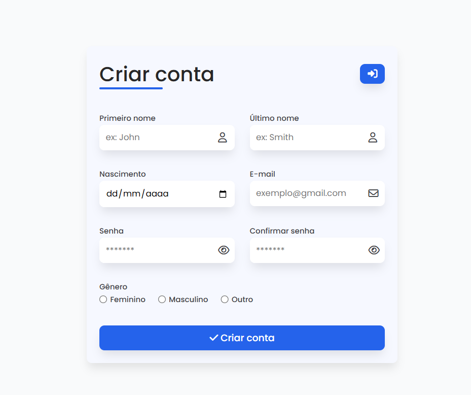
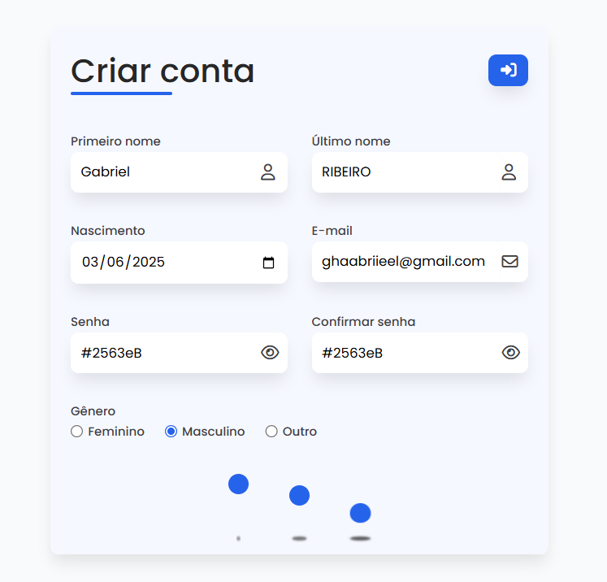
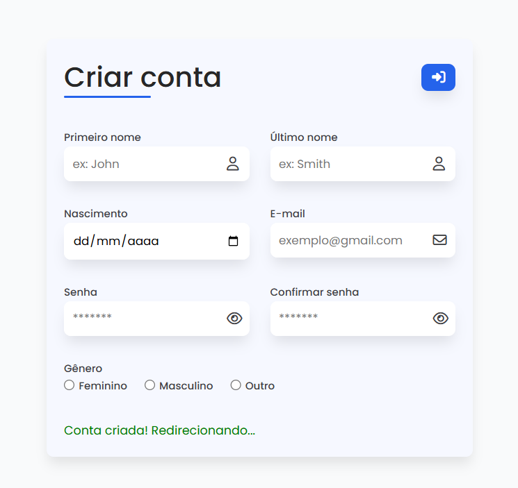

# 📝 Validador de Formulário

Projeto desenvolvido para praticar **JavaScript com Programação Orientada a Objetos (POO)**, criando um validador de formulário.

## 🚀 Funcionalidades

- ✔️ Validação de campos obrigatórios
- ✔️ Verificação se o usuário possui entre 3 a 12 caracteres
- ✔️ Nome e Sobrenome aceita apenas letras
- ✔️ Senha deve ser maior que 4  caracteres
- ✔️ Senha precisa conter:
  - Pelo menos uma letra maiúscula
  - Pelo menos uma letra minúscula
  - Pelo menos um símbolo
- ✔️ Verificar se senha e repetir senha são iguais
- ✔️ Exibição de mensagens de erro dinâmicas

## 💻 Tecnologias

- HTML5
- CSS3
- JavaScript (ES6+)

## 🎯 Objetivo

Praticar manipulação do DOM, lógica de programação, expressões regulares e aplicação de conceitos de Programação Orientada a Objetos.

## 📸 Layout

> 💻 Simples, moderno e responsivo.

  
 
 
## 🛠️ Como executar

Clone o repositório e abra o arquivo `index.html` no navegador.

```bash
git clone https://github.com/Ghabriel-Silva/form-Poo.git
